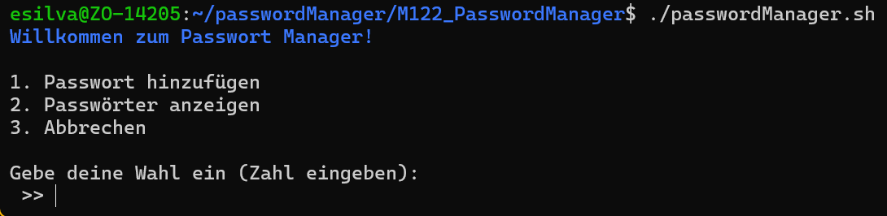
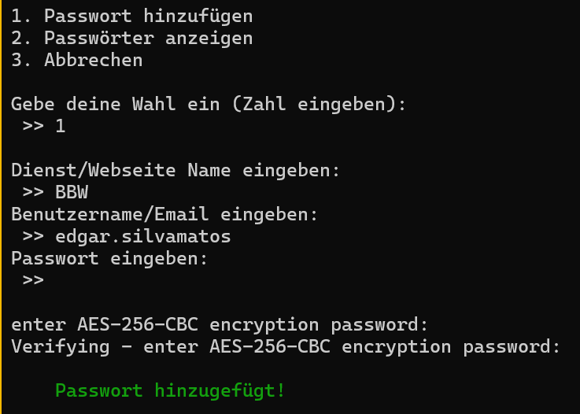
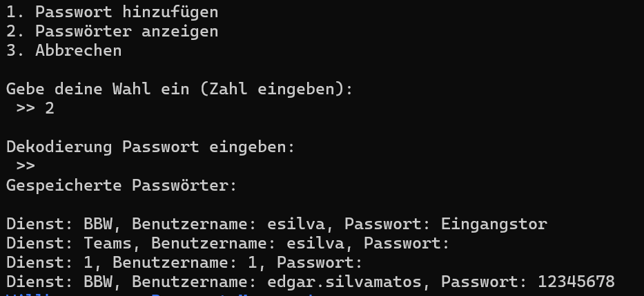
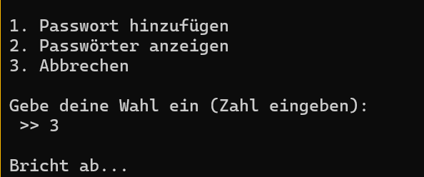
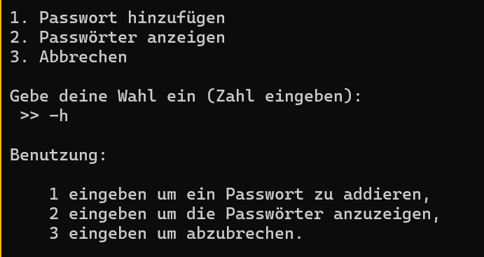

# M122 Password Manager
1. [Projektbeschreibung](#projektbeschreibung)
2. [Anleitung](#anleitung)
    - [Password hinzufügen](#password-hinzufügen)
    - [Passwörter anzeigen](#passwörter-anzeigen)
    - [Abbrechen](#abbrechen)
3. [Bemerkung](#bemerkung)
    - [Entkriminalisierung](#entkriminalisierung)

## Projektbeschreibung
Ein Shell Script zum verwalten der Passwörter. 
Verschlüsselt und entschlüsselt Passwörter auf der Grundlage eines Master-Passworts. Benutzt Bash und OpenSSL. Inspiration genommen von Unix `Pass`.

## Anleitung
Bevor Sie Ihre Zeit mit der Lektüre dieses Abschnitts der Dokumentation verschwenden, beachten Sie bitte, dass es ein sehr schönes Video gibt, in dem das Skript durchgespielt wird und das ungefähr das Gleiche in weniger Worten erklärt.

Der erste Schritt ist das Klonen und Installieren des Repositorys auf Ihrem lokalen Gerät. Das gescheht mit diesem Befehl:
> `git clone https://github.com/edgarsilvamatos/M122_PasswordManager.git`

Nachdem Sie das Projekt geklont, zum Zielort der Datei navigiert und die richtigen Dateiberechtigungen erteilt haben, sollten Sie die Datei ausführen können und folgendes sehen:

### Password hinzufügen
Um ein Kennwort hinzuzufügen, wählen Sie zunächst eine "1" und geben sie ein. Dadurch werden Sie durch den Prozess des Hinzufügens eines Passworts geführt. Hierfür sind drei Dinge erforderlich. Erstens der Dienst, zu dem die Anmeldedaten gehören. Zweitens die E-Mail oder den Benutzernamen. Drittens, das Passwort. 

Natürlich müssen Sie sich auch ein Master-Passwort einfallen lassen. Auch das muss bestätigt werden.

### Passwörter anzeigen
Um die von Ihnen erstellten Passwörter anzuzeigen, können Sie "2" wählen und eingeben. Daraufhin werden Sie nach dem Master-Passwort gefragt. 
Beachten Sie, dass nur die Passwörter angezeigt werden, die mit demselben Master-Passwort erstellt wurden. 

Beispiel auf dem Bildschirmfoto weiter unten. Das Master-Passwort, das ich eingegeben habe, war "1234". Es werden also nur die Kennwörter angezeigt, die mit diesem Hauptkennwort verknüpft sind. Alle anderen, die nicht unter diesem Master-Passwort gespeichert waren, wurden ignoriert und sind daher leer.

### Abbrechen
Bricht das Projekt ab.

### Help
Die Anwendung verfügt auch über eine "Hilfe"-Option, die absolut nicht erst nach Durchsicht der Anforderungen implementiert wurde. Überhaupt nicht... Wie würde man auch nur auf so einen Gedanken kommen?

## Bemerkung
### Entkriminalisierung
Diese Dokumentation wurde in Englisch verfasst und später mit DeepL ins Deutsche übersetzt. Gehen Sie nicht davon aus, dass sie von ChatGPT erstellt wurde. Das wurde sie nicht.
 